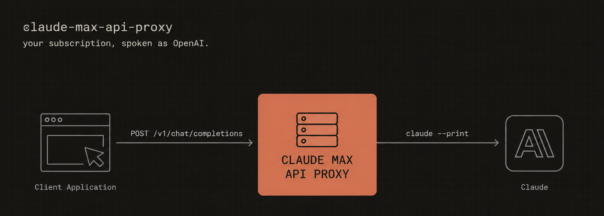

# Claude Max API Proxy



[](LICENSE)
[](package.json)
[](tsconfig.json)

**Put your Claude Code subscription behind an OpenAI-compatible endpoint.** Point any OpenAI
client — the `openai` SDK, Continue.dev, litellm, your own script — at `http://localhost:3456/v1`
and the answers come from the Pro, Max or Team plan you already pay for.

```
your app ──HTTP(OpenAI)──▶ proxy ──spawn──▶ claude CLI ──OAuth──▶ Anthropic
```

The limits are the CLI's own: its rate limits, its models, and no sampling parameters.

## Is it safe?

Your credentials never leave the CLI. Authentication stays in the keychain entry Claude Code
already owns; the proxy holds no token, stores none, and sends none anywhere. It only starts
`claude` in print mode — the documented way to use the CLI programmatically — and translates
what comes back.

What Anthropic refuses is a subscription OAuth token used directly by a third-party client.
That is the risky pattern, and it is precisely the one this avoids: the token stays where it
belongs and only the CLI ever presents it. Requests still count against your subscription's
own limits.

## Install

Node 20+, plus the Claude Code CLI signed in (`npm install -g @anthropic-ai/claude-code &&
claude auth login`).

```bash
git clone https://github.com/mainpart/claude-max-api-proxy.git && cd claude-max-api-proxy
npm install && npm run build
```

## Run

```bash
npm start              # http://localhost:3456
npm start -- 8080      # or another port
```

A first request:

```bash
curl -X POST http://localhost:3456/v1/chat/completions \
  -H "Content-Type: application/json" \
  -d '{"model":"claude-sonnet-4","messages":[{"role":"user","content":"Hello!"}]}'
```

`"stream": true` streams instead; pass `-N` to curl so it does not buffer.
`GET /v1/models` lists the model ids, and `GET /health` says whether the proxy is up.

## Point a client at it

The API key is never checked, but most SDKs insist on a non-empty one.

```python
from openai import OpenAI

client = OpenAI(base_url="http://localhost:3456/v1", api_key="not-needed")

response = client.chat.completions.create(
    model="claude-sonnet-4",
    messages=[{"role": "user", "content": "Hello!"}],
)
```

Anything that reads the standard environment variables needs no code at all:

```bash
export OPENAI_BASE_URL="http://localhost:3456/v1"
export OPENAI_API_KEY="not-needed"
```

Continue.dev:

```json
{
  "models": [{
    "title": "Claude (subscription)",
    "provider": "openai",
    "model": "claude-sonnet-4",
    "apiBase": "http://localhost:3456/v1",
    "apiKey": "not-needed"
  }]
}
```

Model ids follow the `claude-opus-4`, `claude-sonnet-4-5`, `claude-haiku-4-5` pattern, and the
bare aliases `opus`, `sonnet` and `haiku` work too. Sampling parameters (`temperature`,
`top_p`, `max_tokens`) are accepted and ignored, because the CLI does not expose them.

## What reaches the model

A request arrives as an OpenAI `messages` array; the CLI takes a system prompt as a flag and
one turn on stdin. The proxy bridges the two, and the difference between a cheap request and
an expensive one is decided here.

**System messages become the system prompt.** They are passed as `--system-prompt`, which
*replaces* Claude Code's own built-in prompt rather than adding to it. A client that sends no
system message gets an empty one, and the system block disappears from the request entirely.

**Your agent setup stays out.** Under the default `economy` preset the CLI runs with
`--safe-mode --tools ""`: no CLAUDE.md, no automatic memory, no skills, no MCP servers, no
tools. Without it, every request would carry your whole local setup as prompt tokens, which on
a loaded machine dwarfs the question itself. Set `"preset": "agent"` to opt back in — the CLI's
own tool set, permissions skipped — when you want the model to actually do things on your
machine.

**The working directory is a boundary.** By default the CLI runs in
`~/.claude-max-api-proxy/workspace`, an empty directory the proxy owns, so no CLAUDE.md or git
status gets pulled in from wherever the proxy was started, and its transcripts stay out of your
interactive sessions. `"cwd": "inherit"` removes that separation.

**Only the new turn is sent.** OpenAI clients resend the whole history every time. Replaying
it as a fresh prompt would miss the prompt cache, so the proxy recognises the conversation and
resumes the CLI session that already holds it; the history is then already in the session and
only the latest turn goes down stdin. Recognition is by lookup key, tried in this order:

| Strategy | Key | Good for |
|---|---|---|
| `user` | The optional OpenAI `user` field | Clients that send it — an explicit key beats a guess |
| `anchor` | Hash of the last user/assistant pair | Clients that truncate old history; also says where the new turn starts |
| `prefix` | Hash of every message but the last | Exact match; misses if the client rewrites an earlier turn |
| `scan` | The CLI's own transcripts on disk | A cold index after a restart; limited to files touched in the last hour |

The first strategy that finds a live session wins. If none does, the conversation starts a
fresh session with the full history — correct, just uncached. Narrow the list with
`sessionStrategy` for a stricter proxy.

The index of known conversations lives in `~/.claude-max-api-proxy/sessions.json`, and entries
expire after six hours of inactivity. The sessions themselves are the CLI's own: it writes one
`.jsonl` transcript per conversation under `~/.claude/projects/`, in a subdirectory named after
the working directory. Those files are what `--resume` reads, and the proxy does not delete
them.

## Configuration

Layers resolve in order, each overriding the one before:

1. built-in defaults
2. `~/.claude-max-api-proxy/config.json` (or `--config <path>`, or `CLAUDE_PROXY_CONFIG`)
3. `CLAUDE_PROXY_*` environment variables
4. command-line arguments

```json
{
  "port": 3456,
  "host": "127.0.0.1",
  "preset": "economy",
  "cwd": "/Users/you/.claude-max-api-proxy/workspace",
  "timeoutMs": 900000,
  "streaming": { "thinking": "drop" }
}
```

| Key | CLI flag | Environment | Default | Meaning |
|---|---|---|---|---|
| `port` | `--port`, first positional | `CLAUDE_PROXY_PORT` | `3456` | Listening port |
| `host` | `--host` | `CLAUDE_PROXY_HOST` | `127.0.0.1` | Listening address |
| `preset` | `--preset` | `CLAUDE_PROXY_PRESET` | `economy` | `economy` or `agent` |
| `cwd` | `--cwd` | `CLAUDE_PROXY_CWD` | `~/.claude-max-api-proxy/workspace` | Working directory of the CLI subprocess; `inherit` uses the proxy's own |
| `tools` | `--tools` | `CLAUDE_PROXY_TOOLS` | preset decides | Value for the CLI's `--tools` |
| `timeoutMs` | `--timeout-ms` | `CLAUDE_PROXY_TIMEOUT_MS` | `900000` | Per-request timeout |
| `bodyLimit` | `--body-limit` | `CLAUDE_PROXY_BODY_LIMIT` | `10mb` | Largest request body accepted, in the `bytes` format (`512kb`) |
| `extraArgs` | `--extra-arg` (repeatable) | `CLAUDE_PROXY_EXTRA_ARGS` | `[]` | Extra CLI flags |
| `binArgs` | `--bin-arg` (repeatable) | `CLAUDE_PROXY_BIN_ARGS` | `[]` | Arguments before every CLI flag, for wrapper binaries |
| `sessionIndexPath` | `--session-index` | `CLAUDE_PROXY_SESSION_INDEX` | `~/.claude-max-api-proxy/sessions.json` | Where the session index is kept |
| `sessionStrategy` | `--session-strategy` | `CLAUDE_PROXY_SESSION_STRATEGY` | `user,anchor,prefix,scan` | Which lookups to try, in order |
| `sessionLockTimeoutMs` | `--session-lock-ms` | `CLAUDE_PROXY_SESSION_LOCK_MS` | `30000` | Wait for a busy session before starting a fresh one |
| `streaming.thinking` | `--thinking` | `CLAUDE_PROXY_THINKING` | `drop` | `drop`, or `reasoning_content` to forward thinking text |
| `streaming.headerFlushMs` | `--header-flush-ms` | `CLAUDE_PROXY_HEADER_FLUSH_MS` | `1000` | How long SSE headers are held back so failures can still be an HTTP status |
| `streaming.resultGraceMs` | `--result-grace-ms` | `CLAUDE_PROXY_RESULT_GRACE_MS` | `2000` | Grace before the subprocess is killed, so it can finish its transcript |

`CLAUDE_BIN`, `DEBUG` and `DEBUG_SUBPROCESS` are read from the environment as well.

`extraArgs` is configuration only, never read from a request body: flags such as
`--mcp-config`, `--settings` or `--add-dir`, combined with tools enabled, amount to running
code on the machine that holds your subscription, and an HTTP client has no business choosing
them. Flags the proxy sets per request (`--print`, `--output-format`, `--resume`,
`--session-id`, …) are rejected at startup with a message naming the flag.

Notes for working on the code: [CLAUDE.md](CLAUDE.md).

## License

MIT — see [LICENSE](LICENSE).
